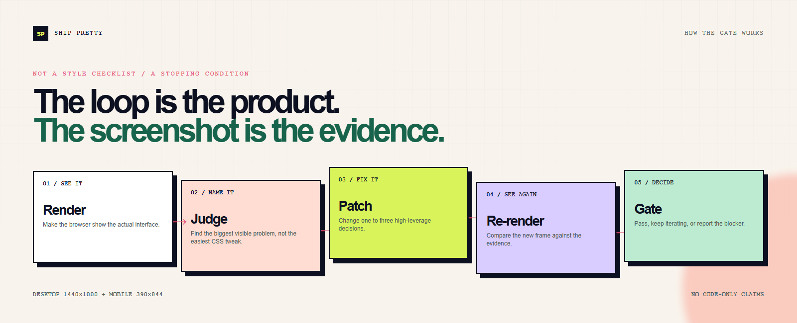

# Ship Pretty

<p align="center">
  
</p>

<p align="center">
  <a href="./README.md">English</a> · <a href="./README.zh-CN.md">简体中文</a>
</p>

> **AI can generate. Ship Pretty decides when it is actually ready to ship.**

AI agents can produce a working frontend and still miss the obvious: weak hierarchy, default composition, repetitive cards, and a mobile layout that only got smaller.

Ship Pretty is an Agent Skill that enforces the visual loop:

**Render → Judge → Patch → Re-render → Quality Gate**

## The 20-second proof

The poster above uses the same landing-page fixture before and after a Ship Pretty pass. The screenshots are real renders at `1440×1000`; the surrounding composition makes the decision legible at a glance.

> **Codex said both were done. Ship Pretty disagreed.**


The refined page is not “better” because it removed every expressive technique. It is better because the page now makes a product decision: the message, action, and proof have different visual jobs.

## The loop

<p align="center">
  
</p>

The loop is the product. The screenshot is the evidence. If the frame fails, the agent returns to the highest-leverage patch instead of polishing code in the dark.

## What the skill forces

1. Establish the page goal and preserve deliberate intent.
2. Render at the relevant desktop and mobile viewports.
3. Judge the whole frame before polishing components.
4. Patch only one to three high-leverage problems.
5. Re-render and compare against the previous frame.
6. Stop only when the visual quality gate passes, or report the blocker.

The default gate is **80/100**, with no dimension below **7/10**:

| Dimension | Question |
| --- | --- |
| Hierarchy | Can the user tell what matters in under three seconds? |
| Composition | Does the frame feel intentionally structured? |
| Typography | Do type scale, measure, and weight create hierarchy? |
| Spacing & density | Does rhythm group meaning instead of padding everything equally? |
| Color & effects | Do accents and effects do structural work? |
| Specificity | Does this feel made for this product? |
| Responsive integrity | Does mobile recompose rather than merely compress? |

## Install

The installable skill package is [`skills/ship-pretty/`](skills/ship-pretty/). Install that folder through your agent's normal Skill workflow, or ask Codex to install the skill from this repository. Its entry point is [`SKILL.md`](skills/ship-pretty/SKILL.md); optional references and the static scanner stay beside it. The package follows the portable `SKILL.md` shape described in [OpenAI Academy's Using skills guide](https://openai.com/academy/skills/).

Example invocation:

```text
Use $ship-pretty on this frontend. Render desktop and mobile, identify the highest-impact visual problems, patch them, and keep looping until the quality gate passes. Show the before/after evidence.
```

## Benchmark set

These are small, framework-free HTML fixtures so the visual evidence does not depend on a particular app stack:

| Benchmark | Tests | Entry |
| --- | --- | --- |
| Landing Page | hero hierarchy, CTA weighting, asymmetric composition | [`examples/demo-ui/index.html`](examples/demo-ui/index.html) |
| Dashboard | information density, release tables, panel stacking | [`examples/benchmarks/dashboard/index.html`](examples/benchmarks/dashboard/index.html) |
| Mobile | mobile-first hierarchy, task scanning, reachable navigation | [`examples/benchmarks/mobile/index.html`](examples/benchmarks/mobile/index.html) |

Each benchmark includes a deliberately generic `before.html` seed. The captured landing-page before/after pair is the primary case study; dashboard and mobile fixtures are additional regression surfaces.

## Verify locally

Run the structural check and static supporting scan:

```bash
python scripts/validate_skill.py .
python skills/ship-pretty/scripts/slop_scan.py examples
```

Capture desktop and mobile evidence with any Playwright-compatible Node runtime:

```bash
node scripts/capture_screenshots.mjs examples/demo-ui/index.html assets/benchmarks/landing-page/after
node scripts/capture_screenshots.mjs examples/benchmarks/dashboard/index.html assets/benchmarks/dashboard/after
node scripts/capture_screenshots.mjs examples/benchmarks/mobile/index.html assets/benchmarks/mobile/after
node scripts/make_showcase_assets.mjs
```

The capture helper expects the `playwright` Node package and a Chromium browser. If they are not already available in your environment, install them locally before capturing:

```bash
npm install --no-save playwright
npx playwright install chromium
```

The capture contract is fixed at **1440×1000** and **390×844**. Screenshots are evidence; the static scanner is only an inspection prompt and cannot judge visual quality. See [`benchmarks/results.md`](benchmarks/results.md) for the latest rendered evidence and comparative scores.

## Repository shape

```text
ship-pretty/
├── README.md
├── README.zh-CN.md
├── assets/
│   ├── demo.gif
│   ├── ship-pretty-hero.png
│   ├── ship-pretty-loop.png
│   ├── social-preview.png
│   └── benchmarks/              # rendered evidence
├── examples/
│   ├── demo-ui/                 # canonical refined landing fixture
│   └── benchmarks/              # dashboard + mobile fixtures and seeds
└── skills/ship-pretty/
    ├── SKILL.md
    ├── agents/openai.yaml
    ├── references/
    └── scripts/
```

## Contributing

The most useful contribution is a reproducible before/after case, not another list of taste rules. Include the prompt, screenshots, viewport sizes, iteration notes, and the failure mode the change catches. See [`CONTRIBUTING.md`](CONTRIBUTING.md) and the [case-study issue template](.github/ISSUE_TEMPLATE/case-study.md).

## License

MIT. See [`LICENSE`](LICENSE).
