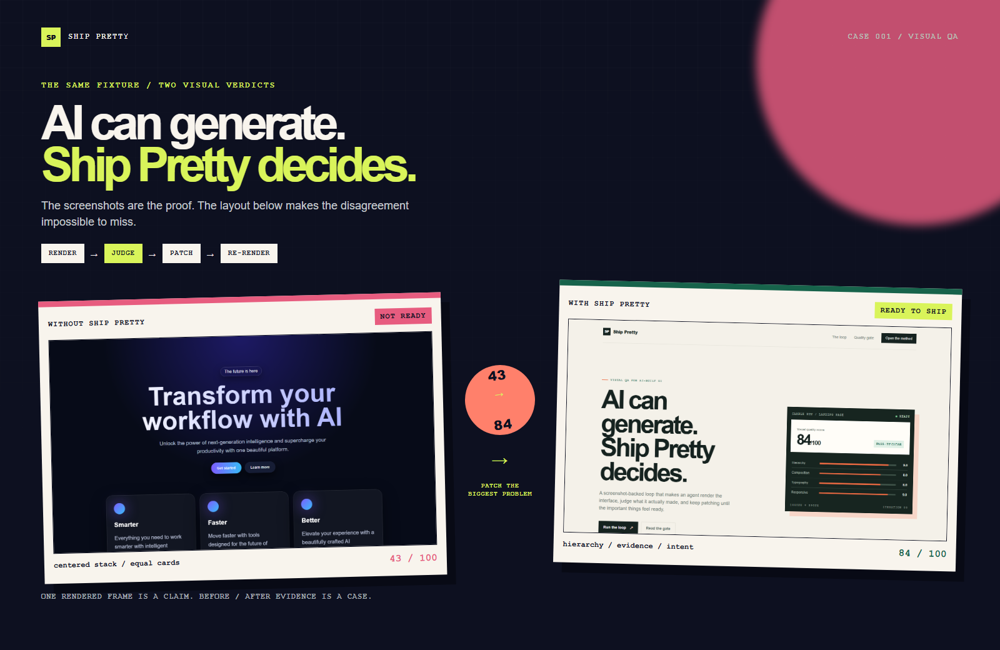
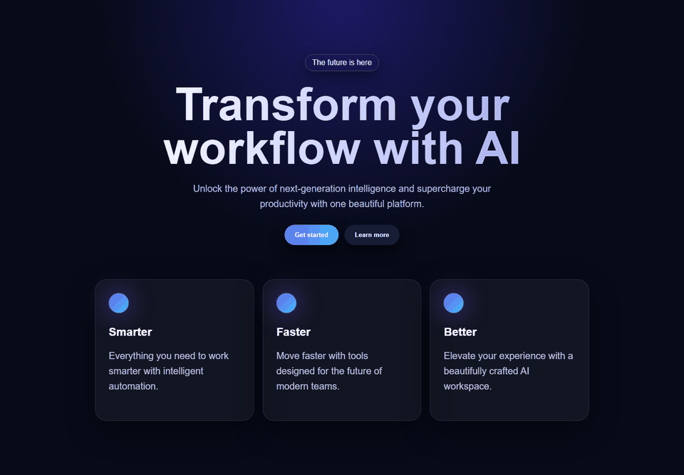
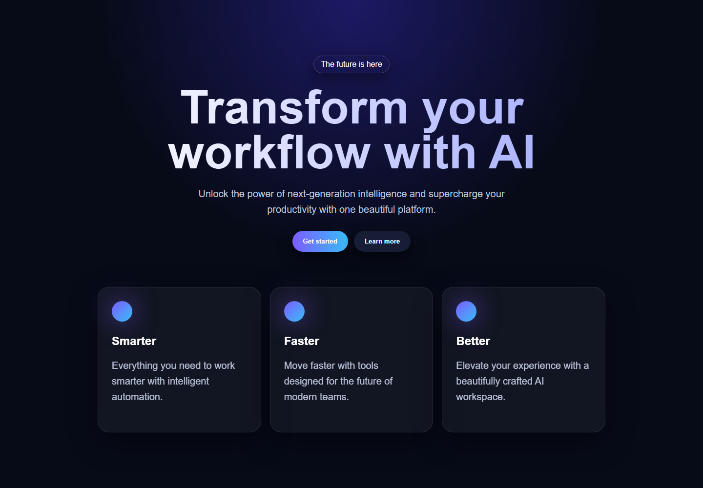
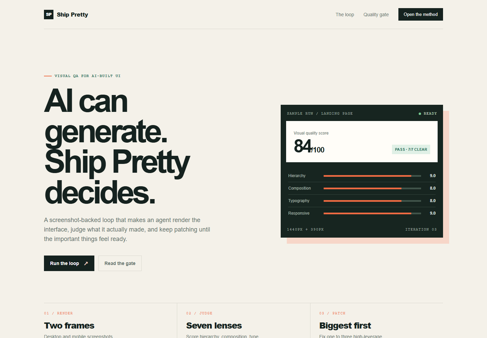
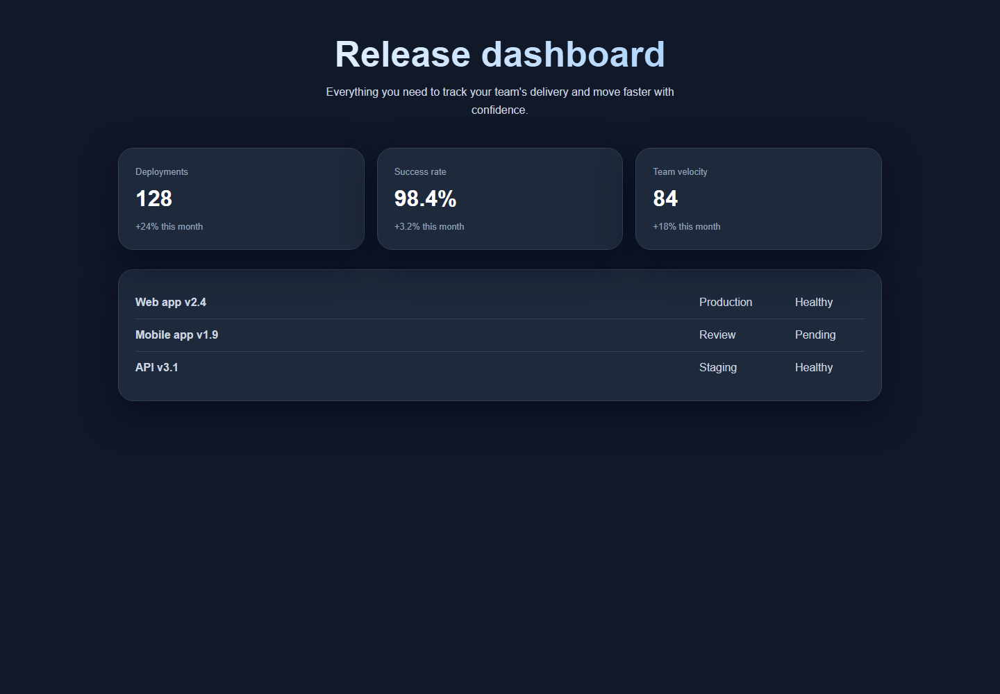
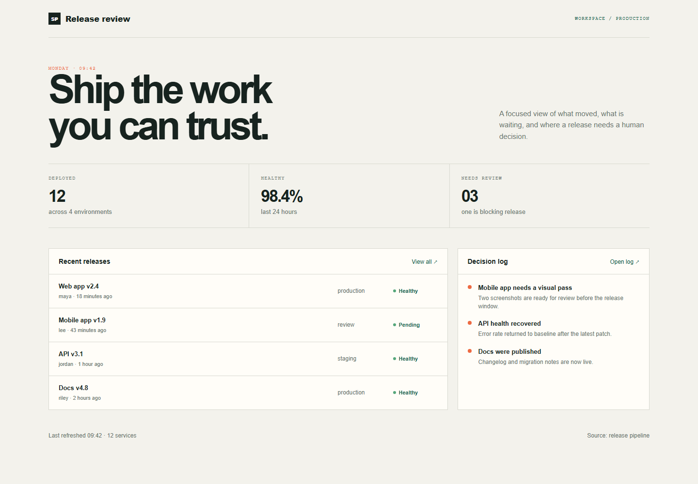
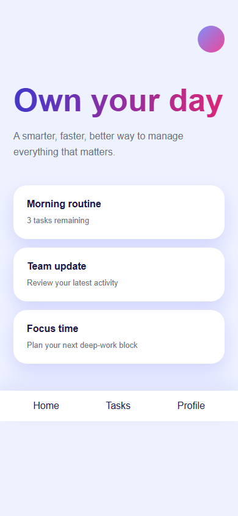
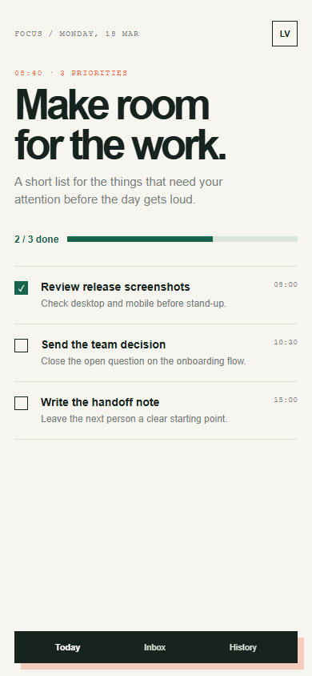

<p align="center">
  
</p>

# Ship Pretty（中文参考）

<p align="center">
  <a href="./README.md">English</a> · <strong>简体中文</strong>
</p>

> **AI 会生成界面，Ship Pretty 决定它是否真的准备好发布。**

Ship Pretty 是一个面向 AI 生成前端的 Agent Skill。它不把“代码能跑”当作视觉完成，而是强制执行：

**Render → Judge → Patch → Re-render → Quality Gate**

真实渲染、查看截图、找出最大问题、修补、再次渲染，直到通过质量门槛，或明确报告阻塞原因。

## 20 秒看懂

上方基准报告使用同一个 Landing Page fixture，展示 Ship Pretty 前后的真实渲染差异。截图是主角，文字只负责标注证据。

> **Codex 说两版都完成了。Ship Pretty 不同意。**



## 工作闭环

**Render → Judge → Patch → Re-render → Gate**

核心不是一张 UI 规则清单，而是一个停止条件：截图不过关，就不能只凭代码宣布完成。

## 怎么使用

把 `skills/ship-pretty/` 通过你的 Agent Skill 工作流安装，然后发送类似指令：

```text
使用 $ship-pretty 检查这个前端。请在桌面和移动端真实渲染，找出影响最大的视觉问题，修补后再次渲染，并持续迭代到通过质量门槛。请保存并展示 Before / After 截图。
```

默认检查桌面 `1440×1000` 和移动端 `390×844`。完整中文门槛参考见 [`skills/ship-pretty/references/quality-gate.zh-CN.md`](skills/ship-pretty/references/quality-gate.zh-CN.md)。

## Benchmark 证据

下面是三个真实浏览器渲染的 Before / After 对比，不是设计稿或装饰性 mockup。

### Landing Page

<table>
  <tr><th>WITHOUT SHIP PRETTY</th><th>WITH SHIP PRETTY</th></tr>
  <tr>
    <td></td>
    <td></td>
  </tr>
</table>

### Dashboard

<table>
  <tr><th>WITHOUT SHIP PRETTY</th><th>WITH SHIP PRETTY</th></tr>
  <tr>
    <td></td>
    <td></td>
  </tr>
</table>

### Mobile

<table>
  <tr><th>WITHOUT SHIP PRETTY</th><th>WITH SHIP PRETTY</th></tr>
  <tr>
    <td></td>
    <td></td>
  </tr>
</table>

- Landing Page：Hero 层级、CTA 权重、不对称构图
- Dashboard：信息密度、发布列表、移动端面板堆叠
- Mobile：任务扫描、进度反馈、底部导航可达性

截图和评分记录见 [`benchmarks/results.md`](benchmarks/results.md)。英文主文档见 [`README.md`](README.md)。
